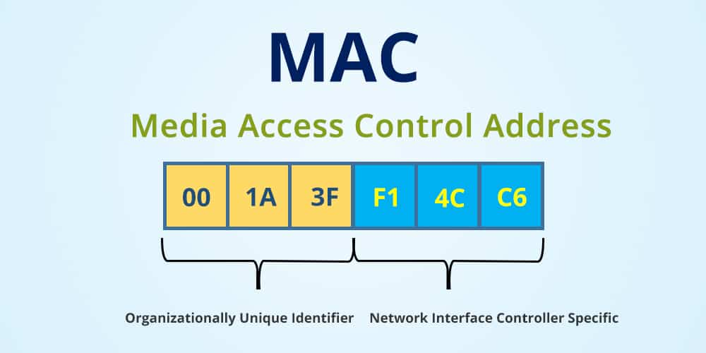
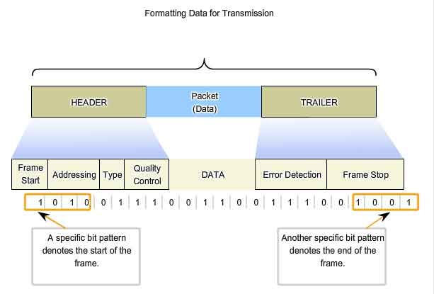
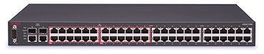

# MAC 주소 
- MAC 주소는 컴퓨터의 **물리적 주소**다.
- 컴퓨터는 통신을 할 때 랜카드(NIC)라는 하드웨어 장비를 사용한다.
- 랜카드는 제조되면서 **고유한 주소**를 부여받는다. (정확히는 랜카드 내에 ROM에 MAC 주소가 저장된다.)

## IP 주소? 맥 주소?
- ip네트워크 계층에서 사용되는 주소로 변할 수 있는 주소다.
- MAC 주소는 데이터링크 계층에서 사용되는 주소로 고정된 주소다.
- ip주소는 네트워크 계층에서 라우터들의 전체적인 경로를 찾을 때 사용돤다.
- MAC 주소는 두 라우터 기기간 전송에서 사용된다. (MAC주소를 통해 바로 다음에 전송할 라우터를 식별함)

## ARP 프로토콜
- ARP 프로토콜은 ip 주소를 MAC 주소로 변환해주는 서비스를 제공하는 프로토콜이다. 
- 라우터간 패킷(프레임) 전송시 ip주소가 아닌 MAC 주소가 필요한데, 이때 ARP 프로토콜을 사용해서 ip주소에 대한 MAC주소를 알아낸다.
- IP주소에 대한 MAC 주소 매핑정보를 ARP 테이블에 저장해 놓는다. 

## MAC 주소의 구성

- 6바이트(48비트)로 구성됨 이를 16진수도 표기한다.
- 8자리마다 하이픈(-) 또는 콜론(:) 또는 점(.)으로 구분한다.

# 프레임, 프레이밍

- 데이터링크 계층에서 사용되는 패킷을 프레임이라고 부른다. 
- 데이터 링크 계층은 패킷 스위치를 통해 라우터간 데이터 전송 기능을 제공한다.(패킷 스위치는 MAC주소를 사용함)
- 즉, 패킷 스위치라는 것을 통해 한 라우터에서 다른 라우터로 프레임을 전송한다. 
- 프레이밍이란 스위치로 들어오는 데이터들에 대해 header와 tailer 비트를 넣어주어, 데이터를 구분하게 해주는 작업을 말한다. 

# 패킷 스위치(네트워크 스위치)란?

- 스위치는 각 컴퓨터(라우터)의 고유한 MAC 주소를 통해 패킷(프레임)을 전송한다. 
- 대부분의 스위치는 전이중 통신 방식(두 대의 단말기가 데이터 송수신시 각각 독립된 회선을 사용하는 방식)을 지원하기에, 향상된 속도를 제공한다. 
- 한 컴퓨터(라우터)가 다른 컴퓨터로 프레임을 보내면 스위치는 패킷(프레임)의 헤더를 읽고, 목적지 MAC 주소를 고려해 적절한 포트를 통해 패킷(프레임)을 내보낸다.

# 패킷 전송 방법
## Circuit Switching
- 데이터 전송 경로가 이미 결정된 상태에서 데이터를 전송하는 방식이다.
- 전화선으로 연결된 두 집이 전화하는 것을 예로 들 수 있다. 
- 하지만 이경우 두 집만 한 회선을 사용하므로 다른 사용자는 사용하지 못하고, 전송 효율이 좋지 않다.

## Packet Switching
- Packet Switching은 데이터를 여러 개의 패킷으로 분할하여 전송하는 방법이다.
- 많은 사용자들이 조각 난 데이터인 패킷을 하나의 회선으로 보낼 수 있기에 전송 효율이 좋다. 
