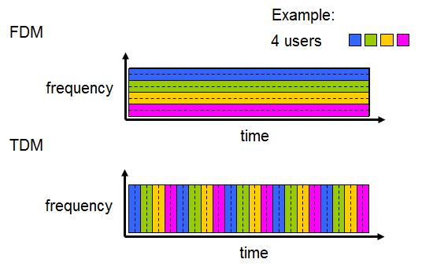
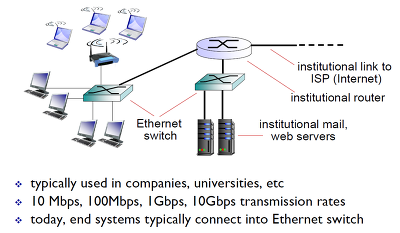

# 통신 방식

## 전이중

- 두 대의 단말기가 데이터를 송수신하기 위해 동시에 각각 독립된 회선을 사용하는 통신 방식
- 전이중 통신 방식은 시분할 이중통신, 주파수 분할 이중통신으로 나눌 수 있다.

### 시분할 다중화 (Time Division Multiplexing, TDM)

- 회선을 시간을 기준으로 분할하여 나눠 쓰는 방법이다.

### 주파수 분할 다중화 (FDM: Frequency Division  Multiplexing)

- 회선을 주파수 기준으로 분할하여 나워 쓰는 방법이다. 

##  반이중

- 한 번에 한쪽 방향으로만 송수신이 가능한 통신 방식이다.

## 단방향 통신

- 한쪽 방향으로만 송신이 가능한 통신 방식이다. 

----

# 이더넷

- LAN, MAN, WAN에서 활용되는 기술규격이다.
- 이더넷은 OSI 모델의 물리 계층에서 신호화 배선, 데이터 링크 계층에서 MAC, 데이터 그램 패킷을 정의한다.
- 이더넷에서는 각 호스트가 고유의 MAC주소를 가지고 이 주소를 기반으로 데이터그램을 주고 받는다. (스위치와 라우터들이 MAC주소를 식별할 수 있다.)

# 맥주소 테이블 (브리지 테이블)

- 수신된 프레임의 송신 MAC 주소를 보고 다음 포트로 정확하게 전달하기 위해 사용하는 테이블이다.
- 스위치가 만들고, 유지하는 테이블이다.
- [참고](https://insbox.tistory.com/entry/Switch%EC%8A%A4%EC%9C%84%EC%B9%98-%EC%99%80-MAC-address)

